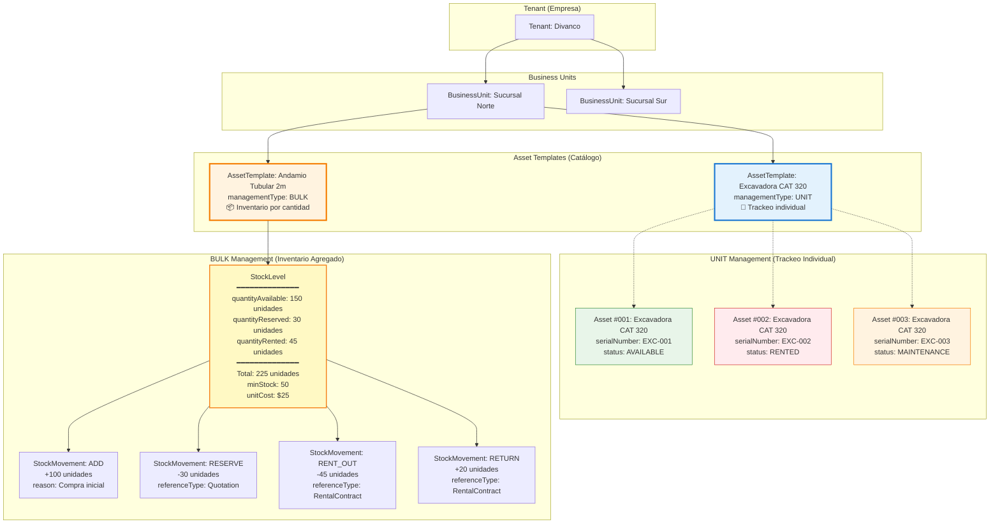
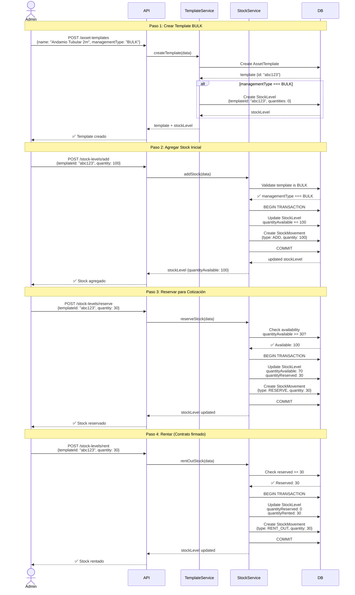
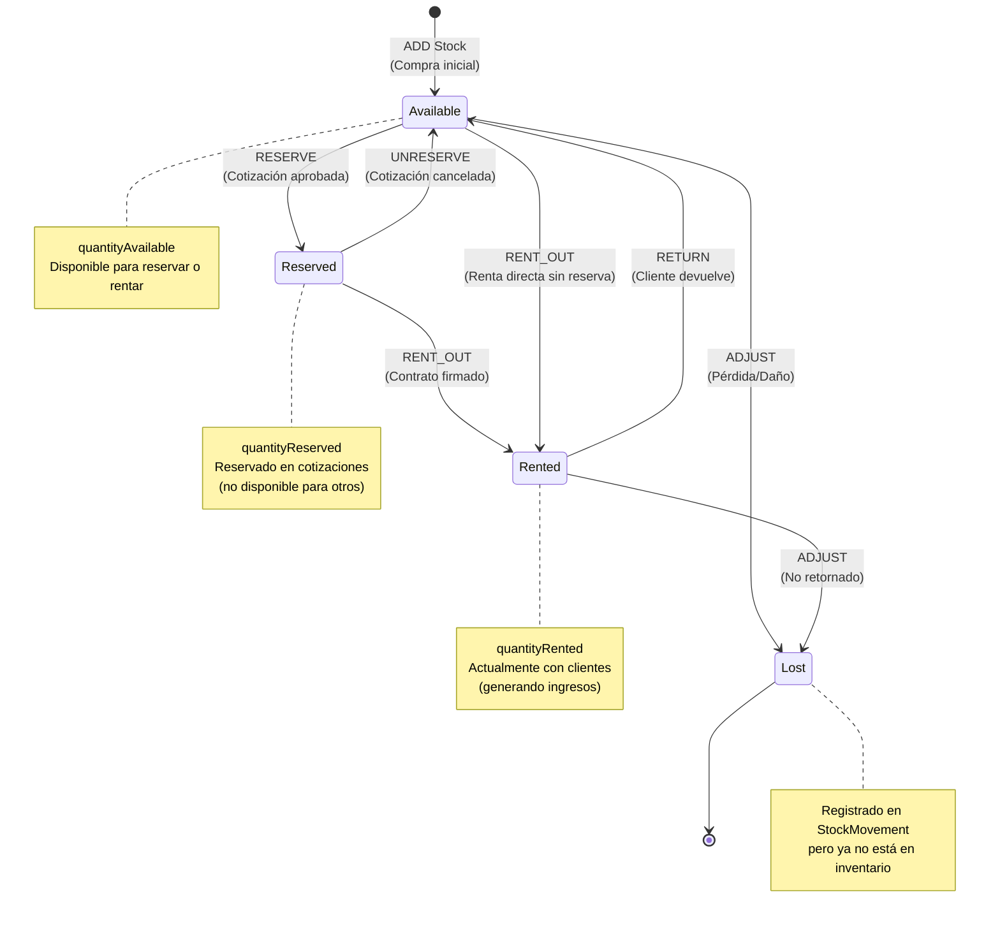
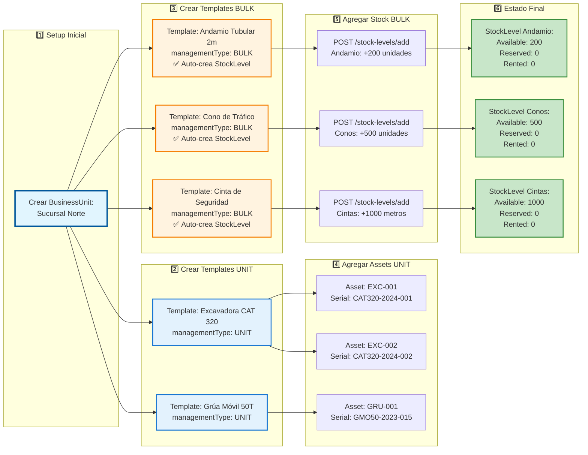

# Diagramas: Implementación de Inventario BULK

Documentación visual de la implementación del sistema de inventario dual (UNIT vs BULK) para el módulo de Assets.

**Fecha:** 14 de Febrero, 2026  
**Versión:** 1.0

---

## 1. Arquitectura General: UNIT vs BULK

Este diagrama muestra la diferencia entre los dos tipos de gestión de inventario:

- **UNIT**: Trackeo individual (cada excavadora tiene su registro Asset)
- **BULK**: Inventario agregado por cantidad (andamios manejados como stock)



---

## 2. Flujo de Creación de Inventario BULK

Secuencia completa de operaciones desde la creación de un template BULK hasta rentar el stock:



---

## 3. Estados y Transiciones del Stock

Diagrama de estados que muestra todas las transiciones posibles del inventario BULK:



### Operaciones por Estado:

| Estado        | Operaciones Permitidas            |
| ------------- | --------------------------------- |
| **Available** | `RESERVE`, `RENT_OUT`, `ADJUST`   |
| **Reserved**  | `UNRESERVE`, `RENT_OUT`, `ADJUST` |
| **Rented**    | `RETURN`, `ADJUST`                |
| **Lost**      | Ninguna (registro histórico)      |

---

## 4. Ejemplo Práctico: Setup de Sucursal Norte

Guía paso a paso para configurar el inventario de una nueva sucursal:



---

## 5. API Endpoints Disponibles

### Stock Management (11 endpoints)

| Método | Endpoint                              | Descripción                              |
| ------ | ------------------------------------- | ---------------------------------------- |
| GET    | `/stock-levels/stats`                 | Estadísticas generales por business unit |
| GET    | `/stock-levels`                       | Listar todos los stock levels            |
| GET    | `/stock-levels/:templateId`           | Ver stock de un template específico      |
| PATCH  | `/stock-levels/:templateId`           | Actualizar precios y límites de alerta   |
| GET    | `/stock-levels/:templateId/movements` | Historial de movimientos de stock        |
| POST   | `/stock-levels/add`                   | Agregar stock (compra/ingreso)           |
| POST   | `/stock-levels/reserve`               | Reservar stock para cotización           |
| POST   | `/stock-levels/unreserve`             | Cancelar reserva de stock                |
| POST   | `/stock-levels/rent`                  | Rentar stock (contrato firmado)          |
| POST   | `/stock-levels/return`                | Devolver stock rentado                   |
| POST   | `/stock-levels/adjust`                | Ajustar por pérdidas/daños               |

### Ejemplos de Request Body

#### Agregar Stock

```json
{
  "templateId": "abc123",
  "quantity": 100,
  "unitCost": 25.5,
  "location": "Bodega A",
  "notes": "Compra inicial de andamios"
}
```

#### Reservar Stock

```json
{
  "templateId": "abc123",
  "quantity": 30,
  "referenceId": "quotation-456",
  "referenceType": "Quotation",
  "notes": "Reservado para cotización #456"
}
```

#### Rentar Stock

```json
{
  "templateId": "abc123",
  "quantity": 30,
  "fromReserved": true,
  "referenceId": "contract-789",
  "referenceType": "RentalContract",
  "notes": "Contrato firmado #789"
}
```

---

## 6. Modelo de Datos

### StockLevel

```typescript
{
  id: string
  assetTemplateId: string
  businessUnitId: string
  location?: string
  quantityAvailable: number    // Disponible para rentar
  quantityReserved: number     // Reservado en cotizaciones
  quantityRented: number       // Actualmente rentado
  minStock?: number            // Alerta de stock bajo
  maxStock?: number            // Límite máximo
  unitCost?: Decimal           // Costo por unidad
  pricePerDay?: Decimal        // Precio de renta diario
  pricePerWeek?: Decimal       // Precio de renta semanal
  pricePerMonth?: Decimal      // Precio de renta mensual
  notes?: string
  createdAt: DateTime
  updatedAt: DateTime
}
```

### StockMovement (Audit Trail)

```typescript
{
  id: string
  stockLevelId: string
  movementType: StockMovementType  // ADD | RESERVE | UNRESERVE | RENT_OUT | RETURN | ADJUST
  quantity: number
  quantityBefore: number
  quantityAfter: number
  referenceId?: string             // ID de quotation o contract
  referenceType?: string           // "Quotation" | "RentalContract"
  performedBy: string              // userId
  notes?: string
  createdAt: DateTime
}
```

---

## 7. Validaciones y Reglas de Negocio

### ✅ Validaciones Automáticas

1. **Template debe ser BULK**: Todas las operaciones validan que `managementType === BULK`
2. **Stock suficiente**: No permite reservar/rentar más de lo disponible
3. **Transacciones atómicas**: Todos los movimientos usan transacciones de BD
4. **Audit trail completo**: Todo movimiento queda registrado en `StockMovement`
5. **Alertas de stock bajo**: Sistema detecta cuando `quantityAvailable <= minStock`

### ⚠️ Restricciones

- No se puede cambiar `managementType` de un template si ya tiene stock o assets
- No se puede eliminar un template BULK si tiene stock > 0
- Los ajustes de tipo `ADJUST` con cantidad negativa reducen stock sin posibilidad de reversa
- Las reservas expiran automáticamente (pendiente implementación de sistema de expiración)

---

## 8. Comparación UNIT vs BULK

| Aspecto              | UNIT                           | BULK                                 |
| -------------------- | ------------------------------ | ------------------------------------ |
| **Propósito**        | Equipos de alto valor          | Materiales consumibles/fungibles     |
| **Ejemplos**         | Excavadoras, grúas, camiones   | Andamios, conos, cintas, EPP         |
| **Modelo BD**        | 1 row en `Asset` por unidad    | 1 row en `StockLevel` por template   |
| **Identificación**   | Serial number único            | Cantidad agregada                    |
| **Trackeo**          | Individual (status, ubicación) | Agregado (available/reserved/rented) |
| **Mantenimiento**    | Preventivo programado          | No aplica                            |
| **Documentación**    | Ficha técnica, manual          | No requerida                         |
| **Cálculo de renta** | Por unidad específica          | Por cantidad solicitada              |

---

## 9. Próximos Pasos (Roadmap)

### Frontend (Pendiente)

- [ ] Selector de `managementType` en formulario de Asset Templates
- [ ] UI de gestión de stock BULK
- [ ] Dashboard de inventario con alertas
- [ ] Widget de stock disponible en pantalla de cotizaciones

### Integraciones (Pendiente)

- [ ] Módulo de Quotations: Reservar BULK items
- [ ] Módulo de Rental Contracts: Rentar/devolver BULK items
- [ ] Sistema de expiración automática de reservas
- [ ] Notificaciones de stock bajo

### Reportes (Pendiente)

- [ ] Reporte de movimientos de stock por período
- [ ] Análisis de rotación de inventario
- [ ] Proyección de necesidades de stock
- [ ] Valoración de inventario (unitCost × quantities)

---

## Referencias

- **Schema**: [backend/prisma/schema.prisma](../backend/prisma/schema.prisma)
- **Service**: [backend/src/modules/assets/services/stock-level.service.ts](../backend/src/modules/assets/services/stock-level.service.ts)
- **Controller**: [backend/src/modules/assets/controllers/stock-level.controller.ts](../backend/src/modules/assets/controllers/stock-level.controller.ts)
- **Migration**: `migrations/20260214142421_add_bulk_inventory_management/`

---

**Última actualización:** 14 de Febrero, 2026  
**Autor:** Mercedes (con asistencia de GitHub Copilot)
