# 🔄 DIAGRAMAS DE FLUJO - CONTRATOS MARCO

**Documento de referencia**: [MASTER_CONTRACT_ARCHITECTURE.md](./MASTER_CONTRACT_ARCHITECTURE.md)

---

## 📊 FLUJO COMPLETO: DESDE COTIZACIÓN HASTA DEVOLUCIÓN

```mermaid
graph TD
    A[Cliente solicita cotización] --> B[Crear Cotización QU-2026-001]
    B --> C{Cliente aprueba?}
    C -->|No| D[Rechazada/Modificada]
    C -->|Sí| E[Cotización APPROVED]

    E --> F[Crear Contrato Marco CON-2026-001]
    F --> G[Generar PDF sin items específicos]
    G --> H[Enviar para firma digital SignNow]

    H --> I{Firma completada?}
    I -->|No| J[Recordatorio/Vencimiento]
    I -->|Sí| K[Contrato ACTIVO]

    K --> L{Cliente tiene saldo?}
    L -->|No| M[Debe acreditar fondos]
    M --> N[POST /account/reload]
    N --> O[ClientAccount balance actualizado]

    L -->|Sí| O

    O --> P[Cliente solicita retiro de implementos]
    P --> Q[POST /deliveries/check-availability]

    Q --> R{Saldo suficiente?}
    R -->|No| S{Límite disponible?}
    S -->|No| T[POST /limit-change-requests]
    T --> U[Owner revisa solicitud]
    U --> V{Aprobada?}
    V -->|No| W[Rechazada - Debe recargar]
    V -->|Sí| X[Límites actualizados]
    X --> Y[POST /contracts/:id/addendums]

    R -->|Sí| Y
    S -->|Sí| T

    Y --> Z[Crear Addendum ADD-001]
    Z --> AA[Generar PDF del addendum]
    AA --> AB{Asset requiere operador?}
    AB -->|Sí| AC[Generar anexo de seguridad]
    AC --> AD[Generar anexo de viáticos]
    AD --> AE[Email con anexos al cliente]
    AB -->|No| AE

    AE --> AF[Descuento en ClientAccount]
    AF --> AG[AssetRental creado - Status: active]
    AG --> AH[Activo entregado al cliente]

    AH --> AI[... Cliente usa el implemento ...]

    AI --> AJ[Cliente devuelve implemento]
    AJ --> AK[PUT /addendums/:id/complete]
    AK --> AL[AssetRental status: completed]
    AL --> AM[Calcular cobro real]
    AM --> AN[Actualizar balance si hay ajustes]
    AN --> AO[Addendum completado]

    AO --> AP{Más entregas pendientes?}
    AP -->|Sí| P
    AP -->|No| AQ[Contrato finalizado]
```

---

## 🏦 FLUJO: VERIFICACIÓN DE SALDO Y LÍMITES

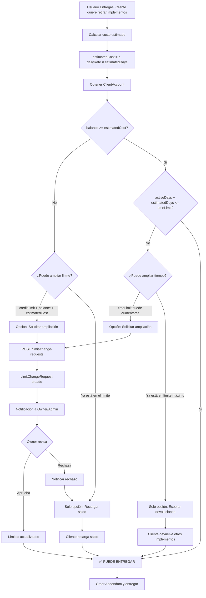

---

## 💬 FLUJO: SOLICITUD DE AMPLIACIÓN DE LÍMITES

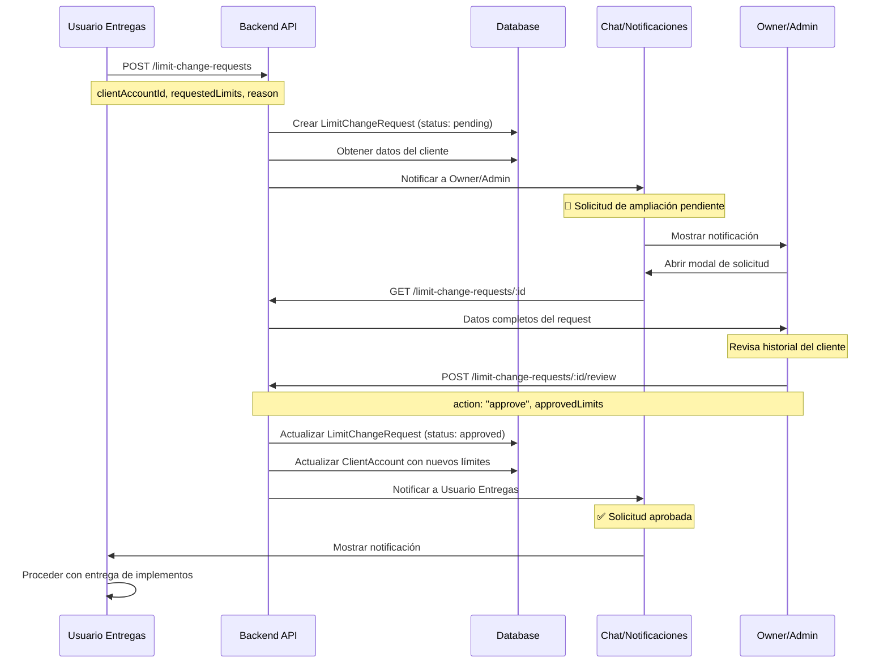

---

## 📄 FLUJO: CREACIÓN DE ADDENDUM CON ANEXOS

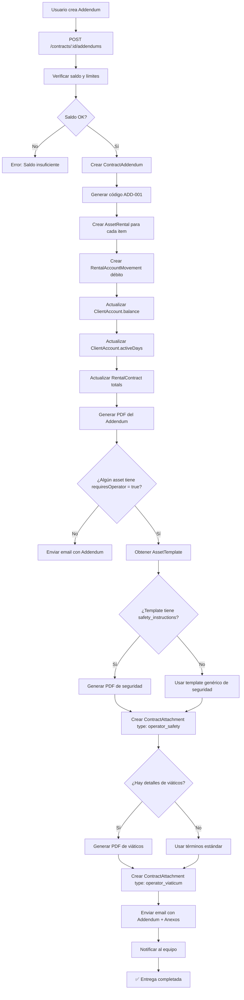

---

## 🔄 FLUJO: DEVOLUCIÓN DE IMPLEMENTOS

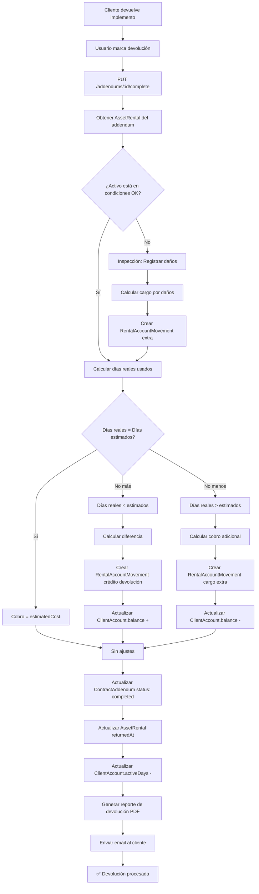

---

## 🎯 ESTADOS DE ENTIDADES

### ClientAccount

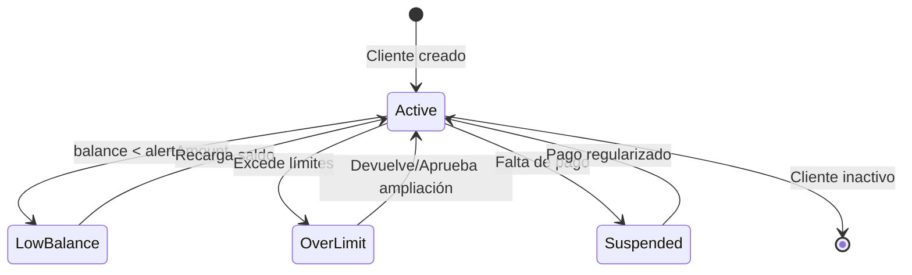

### RentalContract

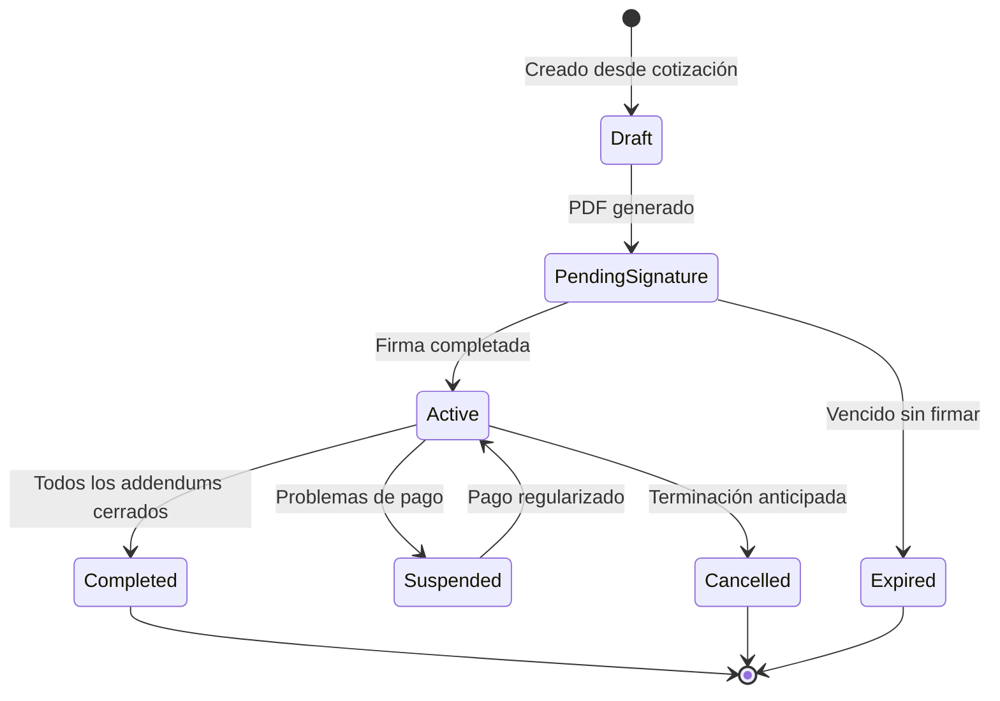

### ContractAddendum

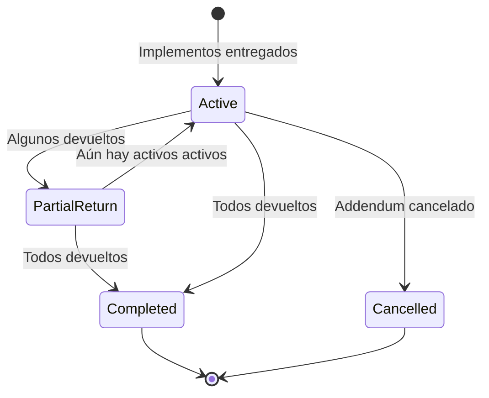

### LimitChangeRequest

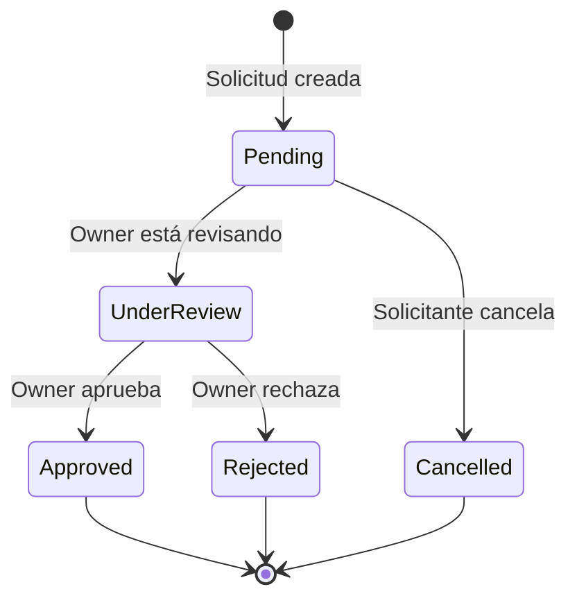

---

## 🔐 PERMISOS Y ROLES

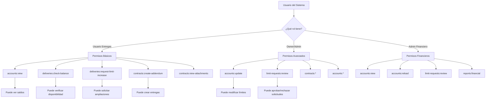

---

## 📊 RELACIONES DE DATOS

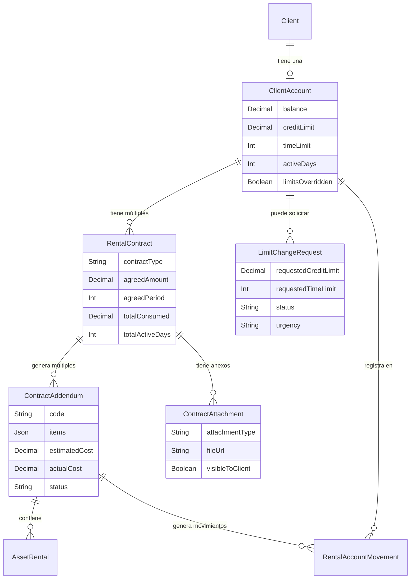

---

## 🎨 UI: PANTALLAS PRINCIPALES

### 1. Dashboard del Cliente

```
┌────────────────────────────────────────────────────────┐
│  CUENTA CORRIENTE - XYZ Construcciones                 │
├────────────────────────────────────────────────────────┤
│                                                         │
│  💰 Saldo Actual:        $3,000,000 COP                │
│  📊 Límite de Crédito:   $10,000,000 COP               │
│  ⏱️  Días Activos:        10 / 60 días                 │
│                                                         │
│  [━━━━━━━━━━━━━━━━━━━━━━━━━━━━━━━━━━━] 30% usado     │
│                                                         │
│  [Recargar Saldo] [Ver Historial] [Ver Contratos]      │
│                                                         │
├────────────────────────────────────────────────────────┤
│  CONTRATOS ACTIVOS                                      │
├────────────────────────────────────────────────────────┤
│  📄 CON-2026-001  |  Activo  |  $2,000,000 consumido   │
│     • 1 Addendum activo (Excavadora)                    │
│     [Ver] [Crear Addendum]                              │
├────────────────────────────────────────────────────────┤
│  ÚLTIMOS MOVIMIENTOS                                    │
├────────────────────────────────────────────────────────┤
│  08/03  Addendum ADD-001      -$2,000,000              │
│  07/03  Recarga inicial       +$5,000,000              │
└────────────────────────────────────────────────────────┘
```

### 2. Verificación de Entrega

```
┌────────────────────────────────────────────────────────┐
│  VERIFICAR DISPONIBILIDAD PARA ENTREGA                 │
├────────────────────────────────────────────────────────┤
│                                                         │
│  Cliente: XYZ Construcciones (#12345)                  │
│                                                         │
│  Implementos a entregar:                               │
│  ┌──────────────────────────────────────────────────┐  │
│  │ ☑ Excavadora CAT 320D                           │  │
│  │   Días: [10] @ $200,000/día = $2,000,000        │  │
│  │                                                  │  │
│  │ ☑ Retroexcavadora                               │  │
│  │   Días: [5] @ $150,000/día = $750,000           │  │
│  └──────────────────────────────────────────────────┘  │
│                                                         │
│  TOTAL ESTIMADO: $2,750,000                            │
│  DÍAS TOTALES: 15 días                                 │
│                                                         │
│  ✅ SALDO DISPONIBLE                                   │
│     Saldo actual:    $3,000,000                        │
│     Después entrega: $250,000                          │
│                                                         │
│  ✅ TIEMPO DISPONIBLE                                   │
│     Días activos:    10 / 60                           │
│     Después entrega: 25 / 60                           │
│                                                         │
│  [Crear Addendum] [Cancelar]                           │
│                                                         │
└────────────────────────────────────────────────────────┘
```

### 3. Solicitud de Ampliación

```
┌────────────────────────────────────────────────────────┐
│  SOLICITAR AMPLIACIÓN DE LÍMITES                       │
├────────────────────────────────────────────────────────┤
│                                                         │
│  Cliente: XYZ Construcciones (#12345)                  │
│  [Ver Historial] [Ver Contratos]                       │
│                                                         │
│  ┌────────────────────────────────────────────────┐    │
│  │ LÍMITES ACTUALES                              │    │
│  │                                                │    │
│  │ Límite de Dinero:  $10,000,000 COP           │    │
│  │ Límite de Tiempo:  60 días                    │    │
│  └────────────────────────────────────────────────┘    │
│                                                         │
│  ┌────────────────────────────────────────────────┐    │
│  │ LÍMITES SOLICITADOS                           │    │
│  │                                                │    │
│  │ Nuevo límite dinero: [$15,000,000]           │    │
│  │ Nuevo límite tiempo: [90] días                │    │
│  └────────────────────────────────────────────────┘    │
│                                                         │
│  Motivo de la solicitud:                               │
│  ┌────────────────────────────────────────────────┐    │
│  │ Proyecto ampliado. Cliente requiere más      │    │
│  │ equipos para segunda fase de construcción.    │    │
│  │ Buen historial de pagos.                      │    │
│  └────────────────────────────────────────────────┘    │
│                                                         │
│  Urgencia: ⚫ Baja  ⚫ Normal  🔵 Alta  ⚫ Urgente       │
│                                                         │
│  [Enviar Solicitud] [Cancelar]                         │
│                                                         │
└────────────────────────────────────────────────────────┘
```

### 4. Panel de Aprobación (Owner)

```
┌────────────────────────────────────────────────────────┐
│  🔔 SOLICITUD DE AMPLIACIÓN PENDIENTE                  │
│  [🚨 URGENCIA ALTA]          Solicitado: 08/03 10:30am │
├────────────────────────────────────────────────────────┤
│                                                         │
│  Cliente: XYZ Construcciones (#12345)                  │
│  [Ver Perfil] [Ver Historial] [Ver Contratos]          │
│                                                         │
│  ┌────────────────────────────────────────────────┐    │
│  │ COMPARACIÓN DE LÍMITES                         │    │
│  ├───────────────────┬──────────────┬─────────────┤    │
│  │                   │   ACTUAL     │  SOLICITADO │    │
│  ├───────────────────┼──────────────┼─────────────┤    │
│  │ Límite Dinero     │ $10,000,000  │ $15,000,000 │    │
│  │ Límite Tiempo     │   60 días    │   90 días   │    │
│  └───────────────────┴──────────────┴─────────────┘    │
│                                                         │
│  Motivo:                                               │
│  "Proyecto ampliado. Cliente requiere más equipos..."  │
│                                                         │
│  ┌────────────────────────────────────────────────┐    │
│  │ APROBAR SOLICITUD                              │    │
│  │                                                │    │
│  │ Nuevo límite dinero: [$15,000,000]           │    │
│  │ Nuevo límite tiempo: [90] días                │    │
│  │                                                │    │
│  │ Notas de revisión:                             │    │
│  │ [Cliente confiable, buen historial...]        │    │
│  └────────────────────────────────────────────────┘    │
│                                                         │
│  [✅ Aprobar] [❌ Rechazar] [Cancelar]                  │
│                                                         │
└────────────────────────────────────────────────────────┘
```

---

**Última actualización**: 8 de marzo de 2026  
**Documento relacionado**: [MASTER_CONTRACT_IMPLEMENTATION_PLAN.md](./MASTER_CONTRACT_IMPLEMENTATION_PLAN.md)
