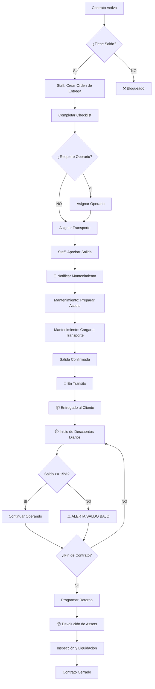

# 📦 MÓDULO DE OPERACIONES Y ENTREGA DE CONTRATOS
**Versión**: 1.0  
**Fecha**: 2026-03-02  
**Estado**: 🔵 Diseño Arquitectónico

---

## 📋 ÍNDICE

1. [Visión General](#visión-general)
2. [Flujo Operacional Completo](#flujo-operacional-completo)
3. [Estados del Contrato (Timeline Visual)](#estados-del-contrato-timeline-visual)
4. [Sistema de Entrega (Delivery)](#sistema-de-entrega-delivery)
5. [Cálculo Diario y Sistema de Alertas](#cálculo-diario-y-sistema-de-alertas)
6. [Modelos de Datos](#modelos-de-datos)
7. [APIs y Endpoints](#apis-y-endpoints)
8. [Componentes Frontend](#componentes-frontend)
9. [Notificaciones y Alertas](#notificaciones-y-alertas)
10. [Checklist de Implementación](#checklist-de-implementación)

---

## 🎯 VISIÓN GENERAL

### Objetivo
Sistema completo de operaciones que gestiona el ciclo de vida desde que un contrato se activa hasta la entrega física de los activos al cliente, con seguimiento en tiempo real del saldo, alertas automáticas y aprobaciones de múltiples actores.

### Actores del Sistema

| Actor | Rol | Permisos |
|-------|-----|----------|
| **Staff Vendedor** | Aprobar salida de activos | `deliveries:approve` |
| **Personal de Mantenimiento** | Preparar y cargar mercadería | `deliveries:prepare` |
| **Operario Externo** | Manejar equipos que requieren operador | `deliveries:operate` |
| **Cliente** | Ver estado del contrato y saldo | `contracts:view_own` |
| **Administrador** | Full control | `admin:*` |

### Principios Clave
1. ✅ **Validación en Capas**: Cliente → Staff → Mantenimiento
2. 📊 **Transparencia Total**: Cliente ve estado en tiempo real
3. ⚠️ **Alertas Proactivas**: 15% saldo = warning automático
4. 🔄 **Descuento Diario**: Cálculo automático nocturno
5. 📸 **Evidencia Digital**: App móvil para operarios

---

## 🔄 FLUJO OPERACIONAL COMPLETO



---

## 📊 ESTADOS DEL CONTRATO (TIMELINE VISUAL)

### Estados Principales

```typescript
enum ContractDeliveryStatus {
  // Estados operacionales
  ACTIVE_PENDING_DELIVERY = "active_pending_delivery",     // Activo, esperando entrega
  DELIVERY_IN_PREPARATION = "delivery_in_preparation",     // Mantenimiento preparando
  DELIVERY_IN_TRANSIT = "delivery_in_transit",             // En camino al cliente
  DELIVERED_OPERATING = "delivered_operating",             // Entregado y operando
  
  // Estados de alerta
  LOW_BALANCE_WARNING = "low_balance_warning",             // Saldo < 15%
  BALANCE_DEPLETED = "balance_depleted",                   // Saldo agotado
  
  // Estados de retorno
  RETURN_SCHEDULED = "return_scheduled",                    // Retorno programado
  RETURN_IN_TRANSIT = "return_in_transit",                  // Retornando
  RETURNED_INSPECTION = "returned_inspection",              // En inspección
  COMPLETED = "completed"                                   // Contrato cerrado
}
```

### Componente Visual: Timeline

```typescript
interface ContractTimeline {
  contractId: string;
  currentStatus: ContractDeliveryStatus;
  steps: TimelineStep[];
  progress: number; // 0-100
}

interface TimelineStep {
  id: string;
  status: ContractDeliveryStatus;
  label: string;
  icon: string;
  completedAt: Date | null;
  isActive: boolean;
  isFuture: boolean;
  metadata?: {
    approvedBy?: string;
    notes?: string;
  };
}
```

**Ejemplo Visual (React Component)**:

```tsx
// ContractTimeline.tsx
<div className="contract-timeline">
  {/* Header con saldo */}
  <div className="timeline-header">
    <h3>Contrato {contract.code}</h3>
    <BalanceBadge 
      current={balance.current} 
      initial={balance.initial}
      percentage={balance.percentage}
      warning={balance.percentage < 15}
    />
  </div>

  {/* Timeline steps */}
  <div className="timeline-steps">
    <Step icon="✅" status="completed" label="Contrato Activo" date="2026-01-15" />
    <Step icon="📋" status="completed" label="Orden de Entrega Creada" date="2026-01-16" />
    <Step icon="👤" status="completed" label="Operario Asignado" date="2026-01-16" />
    <Step icon="✅" status="completed" label="Staff Aprobó Salida" date="2026-01-17" />
    <Step icon="🔧" status="active" label="En Preparación" date={null} />
    <Step icon="🚚" status="future" label="En Tránsito" date={null} />
    <Step icon="📦" status="future" label="Entregado" date={null} />
  </div>

  {/* Assets alquilados */}
  <AssetList assets={contract.assets} />

  {/* Información de días */}
  <DaysInfo 
    startDate={contract.startDate}
    estimatedDays={contract.estimatedDays}
    daysElapsed={contract.daysElapsed}
  />
</div>
```

---

## 📦 SISTEMA DE ENTREGA (DELIVERY)

### Modelo: ContractDelivery

```prisma
model ContractDelivery {
  id                String   @id @default(uuid())
  tenantId          String
  businessUnitId    String
  
  // Relaciones
  contractId        String
  contract          RentalContract @relation(fields: [contractId], references: [id])
  
  // Información de entrega
  deliveryCode      String   @unique  // DEL-2026-001
  deliveryType      DeliveryType     // OUTBOUND (salida) | RETURN (retorno)
  status            DeliveryStatus
  
  // Actores
  requestedById     String   // Staff que creó la orden
  requestedBy       User     @relation("DeliveryRequester", fields: [requestedById], references: [id])
  
  approvedById      String?  // Staff que aprobó salida
  approvedBy        User?    @relation("DeliveryApprover", fields: [approvedById], references: [id])
  approvedAt        DateTime?
  
  preparedById      String?  // Personal de mantenimiento
  preparedBy        User?    @relation("DeliveryPreparer", fields: [preparedById], references: [id])
  preparedAt        DateTime?
  
  // Transporte
  transportId       String?
  transport         Vehicle? @relation(fields: [transportId], references: [id])
  driverId          String?
  driver            User?    @relation("DeliveryDriver", fields: [driverId], references: [id])
  
  // Operarios (para equipos que requieren)
  operators         DeliveryOperator[]
  
  // Items a entregar
  items             DeliveryItem[]
  
  // Checklist
  checklist         DeliveryChecklist[]
  
  // Tracking
  scheduledDate     DateTime  // Fecha programada de entrega
  departureAt       DateTime? // Salió de bodega
  arrivedAt         DateTime? // Llegó al cliente
  completedAt       DateTime?
  
  // Ubicación
  originLocation    String?
  destinationLocation String?
  
  // Notas
  notes             String?   @db.Text
  internalNotes     String?   @db.Text  // Solo visible para staff
  
  // Evidencias
  attachments       DeliveryAttachment[]
  
  createdAt         DateTime  @default(now())
  updatedAt         DateTime  @updatedAt

  @@index([contractId])
  @@index([status])
  @@index([businessUnitId])
}

enum DeliveryType {
  OUTBOUND  // Salida hacia cliente
  RETURN    // Retorno desde cliente
}

enum DeliveryStatus {
  DRAFT             // Borrador
  PENDING_APPROVAL  // Esperando aprobación de staff
  APPROVED          // Aprobada por staff
  IN_PREPARATION    // Mantenimiento preparando
  READY_TO_SHIP     // Lista para salir
  IN_TRANSIT        // En camino
  DELIVERED         // Entregada
  CANCELLED         // Cancelada
}
```

### Modelo: DeliveryOperator

```prisma
model DeliveryOperator {
  id                String   @id @default(uuid())
  
  deliveryId        String
  delivery          ContractDelivery @relation(fields: [deliveryId], references: [id])
  
  operatorId        String
  operator          User     @relation(fields: [operatorId], references: [id])
  
  // Assets asignados a este operario
  assignedAssetIds  String[] // IDs de los DeliveryItem
  
  // Documentación verificada
  hasValidLicense   Boolean  @default(false)
  hasValidCertification Boolean @default(false)
  hasInsurance      Boolean  @default(false)
  
  // Verificado por
  verifiedById      String?
  verifiedBy        User?    @relation("OperatorVerifier", fields: [verifiedById], references: [id])
  verifiedAt        DateTime?
  
  notes             String?
  
  createdAt         DateTime @default(now())
  updatedAt         DateTime @updatedAt

  @@index([deliveryId])
  @@index([operatorId])
}
```

### Modelo: DeliveryItem

```prisma
model DeliveryItem {
  id                String   @id @default(uuid())
  
  deliveryId        String
  delivery          ContractDelivery @relation(fields: [deliveryId], references: [id])
  
  assetId           String
  asset             Asset    @relation(fields: [assetId], references: [id])
  
  quantity          Int      @default(1)  // Para consumibles
  
  // Estado al momento de entrega
  condition         AssetCondition
  conditionNotes    String?
  
  // Evidencias fotográficas
  photosBefore      String[] // URLs de fotos antes de salir
  photosAfter       String[] // URLs de fotos al llegar
  
  // Accesorios incluidos
  accessories       Json?    // { "cables": 2, "manual": true, etc }
  
  requiresOperator  Boolean  @default(false)
  operatorId        String?  // Relación con DeliveryOperator
  
  createdAt         DateTime @default(now())
  updatedAt         DateTime @updatedAt

  @@index([deliveryId])
  @@index([assetId])
}

enum AssetCondition {
  EXCELLENT
  GOOD
  FAIR
  NEEDS_REPAIR
}
```

### Modelo: DeliveryChecklist

```prisma
model DeliveryChecklist {
  id                String   @id @default(uuid())
  
  deliveryId        String
  delivery          ContractDelivery @relation(fields: [deliveryId], references: [id])
  
  // Item del checklist
  category          ChecklistCategory
  requirement       String   // Ej: "Verificar documentos del operario"
  description       String?
  
  isCompleted       Boolean  @default(false)
  completedById     String?
  completedBy       User?    @relation(fields: [completedById], references: [id])
  completedAt       DateTime?
  
  isMandatory       Boolean  @default(true)  // Algunos son opcionales
  evidence          String?  // URL de foto/documento
  
  notes             String?
  
  createdAt         DateTime @default(now())
  updatedAt         DateTime @updatedAt

  @@index([deliveryId])
}

enum ChecklistCategory {
  OPERATOR_DOCUMENTATION  // Licencia, certificados, seguro
  ASSET_CONDITION        // Estado físico del equipo
  ACCESSORIES            // Implementos incluidos
  TRANSPORT              // Vehículo apto, documentos
  CLIENT_REQUIREMENTS    // Firma, recibido conforme
  SAFETY                 // EPP, instrucciones de seguridad
}
```

---

## ⚠️ CÁLCULO DIARIO Y SISTEMA DE ALERTAS

### Cron Job: Descuento Diario Automático

**Archivo**: `backend/src/cron/daily-contract-billing.cron.ts`

```typescript
import cron from "node-cron";
import prisma from "@config/database";
import { accountService } from "@modules/billing/services/account.service";
import { notificationService } from "@core/services/notification.service";

/**
 * Cron Job: Ejecutar descuentos diarios a las 00:01 AM
 * Frecuencia: Todos los días
 */
export function startDailyContractBillingCron() {
  // Ejecutar a las 00:01 AM todos los días
  cron.schedule("1 0 * * *", async () => {
    console.log("[CRON] 🕐 Iniciando descuentos diarios de contratos...");
    
    try {
      // 1. Obtener todos los contratos activos con entrega completada
      const activeContracts = await prisma.rentalContract.findMany({
        where: {
          status: "active",
          deliveryStatus: "delivered_operating",
          deliveredAt: { not: null },
        },
        include: {
          clientAccount: true,
          client: true,
          quotation: {
            include: {
              items: true,
            },
          },
          deliveries: {
            where: { status: "DELIVERED", deliveryType: "OUTBOUND" },
            orderBy: { completedAt: "desc" },
            take: 1,
          },
        },
      });

      console.log(`[CRON] 📋 ${activeContracts.length} contratos activos encontrados`);

      let successCount = 0;
      let warningCount = 0;
      let errorCount = 0;

      for (const contract of activeContracts) {
        try {
          // 2. Calcular días desde la entrega
          const deliveredDate = contract.deliveredAt!;
          const today = new Date();
          const daysElapsed = Math.floor(
            (today.getTime() - deliveredDate.getTime()) / (1000 * 60 * 60 * 24)
          );

          // 3. Calcular cargo diario
          const dailyRate = calculateDailyRate(contract);

          // 4. Descontar de la cuenta del cliente
          const transaction = await accountService.deductBalance({
            accountId: contract.clientAccountId,
            amount: dailyRate,
            type: "rental_daily_charge",
            description: `Cargo diario - Contrato ${contract.code} - Día ${daysElapsed}`,
            referenceId: contract.id,
            referenceType: "rental_contract",
          });

          // 5. Actualizar días transcurridos en el contrato
          await prisma.rentalContract.update({
            where: { id: contract.id },
            data: { 
              daysElapsed,
              lastBilledAt: today,
            },
          });

          // 6. Verificar saldo disponible
          const remainingBalance = await accountService.getAvailableBalance(
            contract.clientAccountId
          );

          const balancePercentage = 
            (remainingBalance / contract.clientAccount.balance) * 100;

          // 7. Sistema de alertas por nivel de saldo
          if (balancePercentage <= 5) {
            // CRÍTICO: Notificar cliente, staff y pausar operaciones
            await handleCriticalBalance(contract, remainingBalance);
            warningCount++;
          } else if (balancePercentage <= 15) {
            // WARNING: Notificar cliente y staff
            await handleLowBalance(contract, remainingBalance, balancePercentage);
            warningCount++;
          }

          successCount++;
          console.log(`[CRON] ✅ ${contract.code}: $${dailyRate} descontado. Saldo: ${balancePercentage.toFixed(1)}%`);

        } catch (error) {
          errorCount++;
          console.error(`[CRON] ❌ Error procesando contrato ${contract.code}:`, error);
          
          // Enviar alerta a administradores
          await notificationService.notifyAdmins({
            type: "billing_error",
            title: "Error en descuento diario",
            message: `No se pudo procesar el contrato ${contract.code}`,
            metadata: { contractId: contract.id, error: error.message },
          });
        }
      }

      console.log(`[CRON] 🎯 Resumen: ${successCount} exitosos, ${warningCount} alertas, ${errorCount} errores`);

    } catch (error) {
      console.error("[CRON] ❌ Error fatal en cron de descuentos:", error);
    }
  });

  console.log("[CRON] ✅ Daily billing cron iniciado (00:01 AM todos los días)");
}

/**
 * Calcular tarifa diaria del contrato
 */
function calculateDailyRate(contract: any): number {
  // Suma de todas las tarifas diarias de los items
  return contract.quotation.items.reduce((total: number, item: any) => {
    return total + (item.dailyRate * item.quantity);
  }, 0);
}

/**
 * Manejar saldo crítico (≤ 5%)
 */
async function handleCriticalBalance(contract: any, balance: number) {
  // 1. Pausar operaciones (marcar contrato como suspendido)
  await prisma.rentalContract.update({
    where: { id: contract.id },
    data: { 
      deliveryStatus: "balance_depleted",
      suspendedAt: new Date(),
    },
  });

  // 2. Notificar cliente (email + in-app)
  await notificationService.sendEmail({
    to: contract.client.email,
    template: "critical_balance_alert",
    data: {
      clientName: contract.client.name,
      contractCode: contract.code,
      remainingBalance: balance,
      dailyRate: calculateDailyRate(contract),
      daysRemaining: Math.floor(balance / calculateDailyRate(contract)),
      topUpUrl: `${process.env.FRONTEND_URL}/billing/top-up`,
    },
  });

  // 3. Notificar staff (para coordinar retorno si no recarga)
  await notificationService.notifyRole({
    role: "staff",
    businessUnitId: contract.businessUnitId,
    type: "critical_balance",
    title: "⚠️ Saldo crítico en contrato",
    message: `El contrato ${contract.code} tiene saldo crítico. Cliente: ${contract.client.name}`,
    actionUrl: `/contracts/${contract.id}`,
  });

  // 4. Crear tarea automática para staff
  await prisma.task.create({
    data: {
      tenantId: contract.tenantId,
      businessUnitId: contract.businessUnitId,
      title: `Saldo crítico - Contrato ${contract.code}`,
      description: `El cliente ${contract.client.name} tiene menos del 5% de saldo. Coordinar recarga o retorno de equipos.`,
      priority: "high",
      dueDate: new Date(Date.now() + 24 * 60 * 60 * 1000), // 24 horas
      referenceType: "rental_contract",
      referenceId: contract.id,
    },
  });
}

/**
 * Manejar saldo bajo (≤ 15%)
 */
async function handleLowBalance(
  contract: any, 
  balance: number,
  percentage: number
) {
  // 1. Actualizar estado del contrato
  await prisma.rentalContract.update({
    where: { id: contract.id },
    data: { deliveryStatus: "low_balance_warning" },
  });

  // 2. Notificar cliente
  await notificationService.sendEmail({
    to: contract.client.email,
    template: "low_balance_warning",
    data: {
      clientName: contract.client.name,
      contractCode: contract.code,
      remainingBalance: balance,
      percentage: percentage.toFixed(1),
      dailyRate: calculateDailyRate(contract),
      daysRemaining: Math.floor(balance / calculateDailyRate(contract)),
      topUpUrl: `${process.env.FRONTEND_URL}/billing/top-up`,
    },
  });

  // 3. Notificación in-app al cliente
  await notificationService.create({
    userId: contract.clientId,
    type: "balance_warning",
    title: "Saldo bajo en tu contrato",
    message: `Tu contrato ${contract.code} tiene ${percentage.toFixed(1)}% de saldo disponible.`,
    actionUrl: `/contracts/${contract.id}`,
    metadata: { 
      contractId: contract.id,
      balance,
      percentage 
    },
  });
}
```

### Dashboard de Alertas (Frontend)

```tsx
// ContractBalanceCard.tsx
interface ContractBalanceCardProps {
  contract: Contract;
  balance: {
    initial: number;
    current: number;
    percentage: number;
    daysRemaining: number;
  };
}

export function ContractBalanceCard({ contract, balance }: ContractBalanceCardProps) {
  const getAlertLevel = () => {
    if (balance.percentage <= 5) return 'critical';
    if (balance.percentage <= 15) return 'warning';
    return 'normal';
  };

  const alertLevel = getAlertLevel();

  return (
    <Card className={`balance-card balance-${alertLevel}`}>
      {/* Header */}
      <CardHeader>
        <h3>{contract.code}</h3>
        <Badge variant={alertLevel}>
          {alertLevel === 'critical' && '🚨 CRÍTICO'}
          {alertLevel === 'warning' && '⚠️ SALDO BAJO'}
          {alertLevel === 'normal' && '✅ ACTIVO'}
        </Badge>
      </CardHeader>

      {/* Barra de progreso */}
      <div className="balance-progress">
        <div className="progress-bar">
          <div 
            className={`progress-fill progress-${alertLevel}`}
            style={{ width: `${balance.percentage}%` }}
          />
        </div>
        <span className="percentage">{balance.percentage.toFixed(1)}%</span>
      </div>

      {/* Detalles */}
      <CardContent>
        <div className="balance-details">
          <div className="detail-item">
            <span className="label">Saldo Inicial</span>
            <span className="value">${balance.initial.toLocaleString()}</span>
          </div>
          <div className="detail-item">
            <span className="label">Saldo Actual</span>
            <span className={`value value-${alertLevel}`}>
              ${balance.current.toLocaleString()}
            </span>
          </div>
          <div className="detail-item">
            <span className="label">Días Restantes (aprox)</span>
            <span className="value">{balance.daysRemaining} días</span>
          </div>
          <div className="detail-item">
            <span className="label">Cargo Diario</span>
            <span className="value">${contract.dailyRate.toLocaleString()}</span>
          </div>
        </div>

        {/* Alertas */}
        {alertLevel === 'critical' && (
          <Alert variant="destructive" className="mt-4">
            <AlertCircle className="h-4 w-4" />
            <AlertTitle>Saldo Crítico</AlertTitle>
            <AlertDescription>
              Operaciones pausadas. Recarga tu saldo inmediatamente para continuar.
            </AlertDescription>
            <Button variant="destructive" className="mt-2">
              Recargar Ahora
            </Button>
          </Alert>
        )}

        {alertLevel === 'warning' && (
          <Alert variant="warning" className="mt-4">
            <AlertTriangle className="h-4 w-4" />
            <AlertTitle>Saldo Bajo</AlertTitle>
            <AlertDescription>
              Te quedan aproximadamente {balance.daysRemaining} días. Considera recargar pronto.
            </AlertDescription>
            <Button variant="outline" className="mt-2">
              Ver Opciones de Recarga
            </Button>
          </Alert>
        )}
      </CardContent>

      {/* Assets alquilados */}
      <CardFooter>
        <div className="rented-assets">
          <h4>Assets Alquilados ({contract.assets.length})</h4>
          <div className="asset-list">
            {contract.assets.map(asset => (
              <AssetChip key={asset.id} asset={asset} />
            ))}
          </div>
        </div>
      </CardFooter>
    </Card>
  );
}
```

---

## 🔔 NOTIFICACIONES Y ALERTAS

### Canales de Notificación

| Evento | Cliente | Staff | Mantenimiento | Operario |
|--------|---------|-------|---------------|----------|
| Orden de entrega creada | ✉️ Email | 📱 In-app | - | - |
| Staff aprobó salida | - | - | 📱 In-app + ✉️ Email | 📱 In-app |
| Preparación completa | - | 📱 In-app | - | ✉️ Email |
| En tránsito | ✉️ Email + 📱 In-app | 📱 In-app | - | 📲 Push |
| Entregado | ✉️ Email | 📱 In-app | - | - |
| Saldo ≤ 15% | ✉️ Email + 📱 In-app + 📲 Push | 📱 In-app | - | - |
| Saldo ≤ 5% | ✉️ Email + 📱 In-app + 📲 Push + SMS | 📱 In-app | 📱 In-app | 📱 In-app |

### Modelo: Notification

```prisma
model Notification {
  id                String   @id @default(uuid())
  tenantId          String
  businessUnitId    String?
  
  // Destinatario
  userId            String
  user              User     @relation(fields: [userId], references: [id])
  
  // Contenido
  type              NotificationType
  title             String
  message           String   @db.Text
  
  // Acción
  actionUrl         String?
  actionLabel       String?
  
  // Prioridad
  priority          NotificationPriority @default(NORMAL)
  
  // Estado
  isRead            Boolean  @default(false)
  readAt            DateTime?
  
  // Metadata
  metadata          Json?    // { contractId, deliveryId, etc }
  
  // Canales enviados
  sentViaEmail      Boolean  @default(false)
  sentViaPush       Boolean  @default(false)
  sentViaSMS        Boolean  @default(false)
  
  expiresAt         DateTime?
  
  createdAt         DateTime @default(now())
  updatedAt         DateTime @updatedAt

  @@index([userId, isRead])
  @@index([type])
  @@index([createdAt])
}

enum NotificationType {
  DELIVERY_CREATED
  DELIVERY_APPROVED
  DELIVERY_IN_PREPARATION
  DELIVERY_IN_TRANSIT
  DELIVERY_COMPLETED
  BALANCE_WARNING
  BALANCE_CRITICAL
  BALANCE_DEPLETED
  CONTRACT_EXPIRING
  RETURN_SCHEDULED
  MAINTENANCE_REQUIRED
  OPERATOR_ASSIGNED
}

enum NotificationPriority {
  LOW
  NORMAL
  HIGH
  URGENT
}
```

---

## 🎨 COMPONENTES FRONTEND

### 1. ContractOperationsView

```tsx
// Pantalla principal de operaciones del contrato
<ContractOperationsView contractId={contractId}>
  {/* Timeline visual */}
  <ContractTimeline contract={contract} />

  {/* Balance y alertas */}
  <ContractBalanceCard contract={contract} balance={balance} />

  {/* Assets alquilados */}
  <RentedAssetsList 
    assets={contract.assets}
    dailyRates={contract.dailyRates}
  />

  {/* Días transcurridos vs acordados */}
  <DaysProgressCard 
    startDate={contract.deliveredAt}
    estimatedDays={contract.estimatedDays}
    daysElapsed={contract.daysElapsed}
  />

  {/* Botón de acción según estado */}
  {renderActionButton()}
</ContractOperationsView>
```

### 2. DeliveryCreationWizard

```tsx
// Wizard para Staff: crear orden de entrega
<DeliveryCreationWizard contractId={contractId}>
  {/* Step 1: Seleccionar assets a entregar */}
  <Step1_SelectAssets />

  {/* Step 2: Asignar transporte */}
  <Step2_AssignTransport />

  {/* Step 3: Asignar operarios (si aplica) */}
  <Step3_AssignOperators />

  {/* Step 4: Completar checklist */}
  <Step4_Checklist />

  {/* Step 5: Revisar y aprobar */}
  <Step5_ReviewAndApprove />
</DeliveryCreationWizard>
```

### 3. MaintenanceDeliveryBoard

```tsx
// Dashboard para personal de mantenimiento
<MaintenanceDeliveryBoard>
  {/* Entregas pendientes de preparar */}
  <Section title="Pendientes de Preparación">
    {pendingDeliveries.map(delivery => (
      <DeliveryCard 
        delivery={delivery}
        onStartPreparation={handleStartPreparation}
      />
    ))}
  </Section>

  {/* En preparación */}
  <Section title="En Preparación">
    {inProgressDeliveries.map(delivery => (
      <DeliveryPreparationCard 
        delivery={delivery}
        onMarkReady={handleMarkReady}
      />
    ))}
  </Section>

  {/* Listas para salir */}
  <Section title="Listas para Salir">
    {readyDeliveries.map(delivery => (
      <DeliveryReadyCard 
        delivery={delivery}
        onConfirmDeparture={handleDeparture}
      />
    ))}
  </Section>
</MaintenanceDeliveryBoard>
```

### 4. OperatorDailyEvidenceApp (Mobile)

```tsx
// App móvil para operarios: subir evidencia diaria
<OperatorDailyEvidenceApp>
  {/* Contratos activos del operario */}
  <MyActiveContracts />

  {/* Subir evidencia de un contrato */}
  <EvidenceUploadScreen contractId={contractId}>
    <CameraCapture onCapture={handlePhotoCapture} />
    <LocationCapture onCapture={handleLocationCapture} />
    <NotesInput onChange={handleNotesChange} />
    <SubmitButton onSubmit={handleSubmit} />
  </EvidenceUploadScreen>

  {/* Historial de evidencias */}
  <EvidenceHistory contractId={contractId} />
</OperatorDailyEvidenceApp>
```

---

## 🛠️ APIs Y ENDPOINTS

### Delivery Endpoints

```typescript
// ============================================
// DELIVERIES
// ============================================

// Crear orden de entrega (Staff)
POST /api/v1/rental/contracts/:contractId/deliveries
Body: {
  deliveryType: "OUTBOUND" | "RETURN",
  scheduledDate: "2026-03-10T10:00:00Z",
  transportId: "transport-id",
  driverId: "user-id",
  operators: [
    {
      operatorId: "user-id",
      assignedAssetIds: ["asset-1", "asset-2"]
    }
  ],
  notes: "Cliente requiere entrega en horario de mañana"
}

// Aprobar salida (Staff con permiso)
POST /api/v1/rental/deliveries/:deliveryId/approve
Body: {
  checklistCompleted: true,
  approvalNotes: "Todo en orden"
}

// Iniciar preparación (Mantenimiento)
POST /api/v1/rental/deliveries/:deliveryId/start-preparation

// Marcar como lista para salir (Mantenimiento)
POST /api/v1/rental/deliveries/:deliveryId/ready-to-ship
Body: {
  items: [
    {
      itemId: "delivery-item-id",
      condition: "GOOD",
      photosBefore: ["url1", "url2"],
      accessories: { "cables": 2, "manual": true }
    }
  ]
}

// Confirmar salida (Mantenimiento/Driver)
POST /api/v1/rental/deliveries/:deliveryId/depart
Body: {
  departureTime: "2026-03-10T10:30:00Z",
  odometerReading: 12345
}

// Confirmar llegada/entrega (Driver/Cliente)
POST /api/v1/rental/deliveries/:deliveryId/complete
Body: {
  arrivalTime: "2026-03-10T12:00:00Z",
  clientSignature: "base64-signature",
  photosAfter: ["url1", "url2"],
  receivedByName: "Juan Pérez",
  receivedByDocument: "12345678"
}

// Listar entregas del contrato
GET /api/v1/rental/contracts/:contractId/deliveries

// Dashboard de mantenimiento
GET /api/v1/rental/deliveries/maintenance-board
Query: ?businessUnitId=bu-id&status=pending_approval,in_preparation
```

### Balance & Alerts Endpoints

```typescript
// Obtener saldo disponible del contrato
GET /api/v1/rental/contracts/:contractId/balance
Response: {
  initial: 10000,
  current: 1200,
  percentage: 12,
  daysElapsed: 45,
  estimatedDaysRemaining: 6,
  dailyRate: 200,
  alertLevel: "warning" | "critical" | "normal"
}

// Obtener historial de cargos diarios
GET /api/v1/rental/contracts/:contractId/billing-history
Response: {
  charges: [
    {
      date: "2026-03-01",
      amount: 200,
      description: "Cargo diario - Día 45",
      balanceAfter: 1200
    }
  ]
}

// Obtener alertas activas
GET /api/v1/notifications/alerts
Query: ?priority=high,urgent&type=balance_warning,balance_critical
```

### Operator Evidence Endpoints

```typescript
// Subir evidencia diaria (App móvil operario)
POST /api/v1/rental/contracts/:contractId/evidence
Body: FormData {
  photo: File,
  latitude: -34.123,
  longitude: -58.456,
  notes: "Operación normal, sin novedades",
  timestamp: "2026-03-02T14:30:00Z"
}

// Obtener evidencias de un contrato
GET /api/v1/rental/contracts/:contractId/evidence
Response: {
  evidence: [
    {
      id: "evidence-id",
      uploadedBy: "operator-name",
      photoUrl: "url",
      location: { lat: -34.123, lng: -58.456 },
      notes: "...",
      timestamp: "2026-03-02T14:30:00Z"
    }
  ]
}
```

---

## ✅ CHECKLIST DE IMPLEMENTACIÓN

### Phase 1: Modelos de Datos (Backend)
- [ ] Crear migration para `ContractDelivery`
- [ ] Crear migration para `DeliveryOperator`
- [ ] Crear migration para `DeliveryItem`
- [ ] Crear migration para `DeliveryChecklist`
- [ ] Crear migration para `DeliveryAttachment`
- [ ] Crear migration para `Notification`
- [ ] Agregar campos `deliveryStatus`, `deliveredAt`, `daysElapsed`, `lastBilledAt` a `RentalContract`
- [ ] Ejecutar `npx prisma db push` y verificar

### Phase 2: Servicios Core (Backend)
- [ ] `delivery.service.ts`: CRUD de entregas
- [ ] `delivery-approval.service.ts`: Flujo de aprobaciones
- [ ] `delivery-tracking.service.ts`: Tracking de transporte
- [ ] `operator-verification.service.ts`: Validar documentación de operarios
- [ ] `contract-billing.service.ts`: Cálculos de cargos diarios
- [ ] `notification.service.ts`: Sistema de notificaciones multi-canal
- [ ] `alert.service.ts`: Lógica de alertas por saldo

### Phase 3: Cron Jobs (Backend)
- [ ] `daily-contract-billing.cron.ts`: Descuentos diarios automáticos
- [ ] `balance-alert.cron.ts`: Verificar saldos y enviar alertas
- [ ] `contract-expiration.cron.ts`: Alertas de contratos próximos a vencer
- [ ] Registrar crons en `src/index.ts`

### Phase 4: API Endpoints (Backend)
- [ ] Endpoints de Deliveries (crear, aprobar, tracking)
- [ ] Endpoints de Balance (consultar, historial)
- [ ] Endpoints de Notificaciones (listar, marcar leído)
- [ ] Endpoints de Evidencias (operarios móviles)
- [ ] Endpoints de Dashboard (mantenimiento, staff)
- [ ] Agregar a `rental.routes.ts`

### Phase 5: Componentes Web (Frontend)
- [ ] `ContractTimeline.tsx`: Timeline visual de estados
- [ ] `ContractBalanceCard.tsx`: Card de saldo con alertas
- [ ] `RentedAssetsList.tsx`: Lista de assets alquilados
- [ ] `DaysProgressCard.tsx`: Progreso de días
- [ ] `DeliveryCreationWizard.tsx`: Wizard para crear entregas
- [ ] `MaintenanceDeliveryBoard.tsx`: Dashboard de mantenimiento
- [ ] `DeliveryTrackingMap.tsx`: Mapa de tracking en tiempo real
- [ ] `ContractOperationsView.tsx`: Vista principal de operaciones

### Phase 6: App Móvil Operarios
- [ ] `OperatorDashboard.tsx`: Contratos asignados
- [ ] `EvidenceUploadScreen.tsx`: Captura de fotos y ubicación
- [ ] `EvidenceHistory.tsx`: Historial de evidencias
- [ ] Configurar permisos de cámara y ubicación
- [ ] Push notifications para operarios

### Phase 7: Notificaciones
- [ ] Templates de email (saldo bajo, crítico, entrega creada, etc)
- [ ] Configurar transporte SMS (Twilio)
- [ ] Push notifications web (Firebase)
- [ ] Push notifications mobile (Expo)
- [ ] Centro de notificaciones in-app

### Phase 8: Testing
- [ ] Tests unitarios: servicios de billing
- [ ] Tests unitarios: servicios de delivery
- [ ] Tests de integración: flujo completo de entrega
- [ ] Tests de integración: cron de descuentos
- [ ] Tests E2E: crear entrega → aprobar → entregar
- [ ] Tests E2E: alertas de saldo

### Phase 9: Documentación
- [ ] Documentar APIs en Swagger
- [ ] Guía de usuario: Staff (crear entregas)
- [ ] Guía de usuario: Mantenimiento (preparar entregas)
- [ ] Guía de usuario: Operarios (evidencia móvil)
- [ ] Guía de usuario: Clientes (ver estado de contrato)

### Phase 10: Deploy
- [ ] Verificar variables de entorno (SMTP, SMS, Push)
- [ ] Ejecutar migrations en producción
- [ ] Activar cron jobs en servidor
- [ ] Smoke test en producción
- [ ] Monitoreo de alertas (Sentry, logs)

---

## 🎯 PRÓXIMOS PASOS

1. **Validar diseño con el equipo**: Revisar este documento con stakeholders
2. **Priorizar features**: ¿Empezamos con deliveries o con billing diario?
3. **Crear tickets en backlog**: Dividir en sprints
4. **Preparar datos de prueba**: Contratos de ejemplo con diferentes estados
5. **Diseñar mockups UI**: Wireframes de componentes clave

---

**Fin del documento** | Versión 1.0 | 2026-03-02
