# Módulo Rental - Rutas y Endpoints

## 🎯 Resumen de Implementación

Se ha completado la implementación del módulo **Rental** (Cotizaciones, Firma Digital y Contratos) con todas sus rutas, controladores y servicios.

## 📍 Base URL

```
http://localhost:3000/api/v1/rental
```

---

## 🔐 Autenticación

Todas las rutas requieren autenticación Bearer JWT (excepto webhooks).

```
Authorization: Bearer {token}
```

---

## 📋 Endpoints Disponibles

### **1. QUOTATIONS (Cotizaciones)**

#### 1.1. Listar Cotizaciones

```http
GET /api/v1/rental/quotations
```

**Query Parameters:**

- `businessUnitId` (required): ID de la unidad de negocio
- `status` (optional): draft | signature_pending | signed | paid | contract_created | cancelled
- `clientId` (optional): ID del cliente

**Response 200:**

```json
{
  "success": true,
  "data": [
    {
      "id": "uuid",
      "code": "QU-2026-001",
      "businessUnitId": "uuid",
      "clientId": "uuid",
      "client": {
        "id": "uuid",
        "name": "Cliente Name",
        "email": "cliente@example.com"
      },
      "status": "draft",
      "subtotal": 8000.00,
      "taxAmount": 1520.00,
      "totalAmount": 9520.00,
      "currency": "USD",
      "quotationDate": "2026-02-11T00:00:00Z",
      "validUntil": "2026-03-11T00:00:00Z",
      "items": [...],
      "createdAt": "2026-02-11T00:00:00Z"
    }
  ]
}
```

---

#### 1.2. Obtener Cotización por ID

```http
GET /api/v1/rental/quotations/:id
```

**Response 200:**

```json
{
  "success": true,
  "data": {
    "id": "uuid",
    "code": "QU-2026-001",
    "client": {...},
    "businessUnit": {...},
    "items": [
      {
        "id": "uuid",
        "assetId": "uuid",
        "description": "Retroexcavadora CAT 420F",
        "quantity": 1,
        "unitPrice": 8000.00,
        "totalPrice": 8000.00,
        "rentalStartDate": "2026-02-15",
        "rentalEndDate": "2026-02-20"
      }
    ],
    "pdfUrl": "https://stdivancodev.blob.core.windows.net/...",
    "signedPdfUrl": null,
    "signatureStatus": null
  }
}
```

---

#### 1.3. Crear Cotización

```http
POST /api/v1/rental/quotations
```

**Request Body:**

```json
{
  "businessUnitId": "uuid",
  "clientId": "uuid",
  "validUntil": "2026-03-11",
  "items": [
    {
      "assetId": "uuid",
      "description": "Retroexcavadora CAT 420F",
      "quantity": 1,
      "unitPrice": 8000.0,
      "rentalStartDate": "2026-02-15",
      "rentalEndDate": "2026-02-20"
    }
  ],
  "taxRate": 19,
  "currency": "USD",
  "notes": "Condiciones especiales...",
  "termsAndConditions": "1. Pago anticipado..."
}
```

**Response 201:**

```json
{
  "success": true,
  "data": {
    "id": "uuid",
    "code": "QU-2026-001",
    "subtotal": 8000.0,
    "taxAmount": 1520.0,
    "totalAmount": 9520.0,
    "status": "draft"
  }
}
```

---

#### 1.4. Generar PDF de Cotización

```http
POST /api/v1/rental/quotations/:id/generate-pdf
```

**Response 200:**

```json
{
  "success": true,
  "data": {
    "pdfUrl": "https://stdivancodev.blob.core.windows.net/uploads/tenant-id/bu-id/quotations/uuid.pdf"
  }
}
```

---

#### 1.5. Solicitar Firma Digital

```http
POST /api/v1/rental/quotations/:id/request-signature
```

**Request Body:**

```json
{
  "signers": [
    {
      "email": "cliente@example.com",
      "name": "Juan Pérez",
      "role": "client",
      "order": 1
    },
    {
      "email": "vendedor@empresa.com",
      "name": "María López",
      "role": "seller",
      "order": 2
    }
  ]
}
```

**Response 200:**

```json
{
  "success": true,
  "data": {
    "requestId": "signow-doc-123",
    "status": "pending",
    "signers": [
      {
        "email": "cliente@example.com",
        "name": "Juan Pérez",
        "status": "pending",
        "signUrl": "https://app.signnow.com/sign/..."
      }
    ],
    "expiresAt": "2026-02-18T00:00:00Z"
  }
}
```

---

#### 1.6. Crear Contrato desde Cotización

```http
POST /api/v1/rental/quotations/:id/create-contract
```

**Requisitos:**

- La cotización debe estar firmada (`signatureStatus: "signed"`)
- La cotización debe estar pagada (`paymentStatus: "paid"`)

**Response 201:**

```json
{
  "success": true,
  "data": {
    "id": "uuid",
    "code": "CON-2026-001",
    "quotationId": "uuid",
    "status": "active",
    "startDate": "2026-02-15",
    "endDate": "2026-02-20",
    "totalAmount": 9520.0,
    "pdfUrl": "...",
    "signedPdfUrl": "..."
  }
}
```

---

### **2. CONTRACTS (Contratos)**

#### 2.1. Listar Contratos

```http
GET /api/v1/rental/contracts
```

**Query Parameters:**

- `businessUnitId` (required): ID de la unidad de negocio
- `status` (optional): active | completed | cancelled | expired
- `quotationId` (optional): Filtrar por cotización específica

**Response 200:**

```json
{
  "success": true,
  "data": [
    {
      "id": "uuid",
      "code": "CON-2026-001",
      "quotationId": "uuid",
      "quotation": {
        "code": "QU-2026-001",
        "client": {...}
      },
      "status": "active",
      "startDate": "2026-02-15",
      "endDate": "2026-02-20",
      "totalAmount": 9520.00,
      "createdAt": "2026-02-11T00:00:00Z"
    }
  ]
}
```

---

#### 2.2. Obtener Contrato por ID

```http
GET /api/v1/rental/contracts/:id
```

**Response 200:**

```json
{
  "success": true,
  "data": {
    "id": "uuid",
    "code": "CON-2026-001",
    "quotation": {
      "code": "QU-2026-001",
      "client": {...},
      "items": [...]
    },
    "businessUnit": {...},
    "status": "active",
    "pdfUrl": "...",
    "signedPdfUrl": "..."
  }
}
```

---

### **3. TEMPLATES (Plantillas de Documentos)**

#### 3.1. Listar Plantillas

```http
GET /api/v1/rental/templates
```

**Query Parameters:**

- `businessUnitId` (required): ID de la unidad de negocio
- `type` (optional): quotation | contract | invoice | certificate

**Response 200:**

```json
{
  "success": true,
  "data": [
    {
      "id": "uuid",
      "name": "Cotización Premium",
      "type": "quotation",
      "content": "<html>...{{client.name}}...</html>",
      "logoUrl": "...",
      "isActive": true,
      "createdAt": "2026-02-10T00:00:00Z"
    }
  ]
}
```

---

#### 3.2. Obtener Plantilla por ID

```http
GET /api/v1/rental/templates/:id
```

---

#### 3.3. Crear Plantilla

```http
POST /api/v1/rental/templates
```

**Request Body:**

```json
{
  "businessUnitId": "uuid",
  "name": "Cotización Estándar",
  "type": "quotation",
  "content": "<html><h1>{{company.name}}</h1><p>Cliente: {{client.name}}</p></html>",
  "styles": "body { font-family: Arial; } h1 { color: #333; }",
  "logoUrl": "https://..."
}
```

**Response 201:**

```json
{
  "success": true,
  "data": {
    "id": "uuid",
    "name": "Cotización Estándar",
    "type": "quotation",
    "isActive": true
  }
}
```

---

#### 3.4. Actualizar Plantilla

```http
PUT /api/v1/rental/templates/:id
```

**Request Body:**

```json
{
  "name": "Cotización Premium V2",
  "content": "<html>...</html>",
  "styles": "...",
  "isActive": true
}
```

---

#### 3.5. Eliminar Plantilla

```http
DELETE /api/v1/rental/templates/:id
```

**Response 200:**

```json
{
  "success": true,
  "message": "Template deleted successfully"
}
```

**Nota:** Es un soft delete, la plantilla se marca como `isActive: false`

---

### **4. WEBHOOKS**

#### 4.1. Webhook de Firma Digital

```http
POST /api/v1/rental/webhooks/digital-signature/:provider
```

**Path Parameters:**

- `provider`: signow | docusign

**Headers:**

- `X-Signature`: Firma HMAC para validar webhook

**Request Body (SignNow):**

```json
{
  "event": "document.signed",
  "document_id": "abc123",
  "signer": {
    "email": "cliente@example.com",
    "name": "Juan Pérez"
  },
  "signed_at": 1707686400,
  "download_link": "https://..."
}
```

**Response 200:**

```json
{
  "success": true,
  "received": "signed"
}
```

**Nota:** Este endpoint NO requiere autenticación (público para proveedores externos).

---

## 🔄 Flujo Completo

### Flujo de Negocio: Cotización → Firma → Pago → Contrato

```mermaid
graph LR
    A[Crear Cotización] --> B[Generar PDF]
    B --> C[Solicitar Firma]
    C --> D[Cliente Firma]
    D --> E[Webhook Recibido]
    E --> F[PDF Firmado Guardado]
    F --> G[Procesar Pago]
    G --> H[Crear Contrato]
```



### Ejemplo de Uso:

```bash
# 1. Crear cotización
curl -X POST http://localhost:3000/api/v1/rental/quotations \
  -H "Authorization: Bearer {token}" \
  -H "Content-Type: application/json" \
  -d '{
    "businessUnitId": "uuid",
    "clientId": "uuid",
    "items": [...]
  }'

# 2. Generar PDF
curl -X POST http://localhost:3000/api/v1/rental/quotations/{id}/generate-pdf \
  -H "Authorization: Bearer {token}"

# 3. Solicitar firma
curl -X POST http://localhost:3000/api/v1/rental/quotations/{id}/request-signature \
  -H "Authorization: Bearer {token}" \
  -d '{
    "signers": [{"email": "cliente@example.com", "name": "Juan"}]
  }'

# 4. Cliente recibe email y firma en SignNow
# SignNow envía webhook automáticamente cuando se completa

# 5. Después del pago, crear contrato
curl -X POST http://localhost:3000/api/v1/rental/quotations/{id}/create-contract \
  -H "Authorization: Bearer {token}"
```

---

## 📊 Swagger Documentation

Visita la documentación interactiva en:

```
http://localhost:3000/api-docs
```

Busca los tags:

- **Quotations** - Gestión de cotizaciones
- **Contracts** - Gestión de contratos
- **Templates** - Plantillas de documentos

---

## ✅ Checklist de Componentes Implementados

### Backend

- [x] **Prisma Schema**
  - [x] Template model
  - [x] Quotation model
  - [x] QuotationItem model
  - [x] QuotationContract model
  - [x] DIGITAL_SIGNATURE enum

- [x] **Core Contracts**
  - [x] `DigitalSignatureProvider` interface
  - [x] Tipos: SignatureRequest, SignatureStatus, etc.

- [x] **Adapters**
  - [x] SignNowAdapter (firma digital)
  - [x] DigitalSignatureResolver
  - [x] AzureBlobStorageService

- [x] **Services**
  - [x] `quotation.service.ts` - Lógica de negocio completa
  - [x] `template.service.ts` - Renderizado y PDFs

- [x] **Controllers**
  - [x] `quotation.controller.ts` - 6 endpoints
  - [x] `contract.controller.ts` - 2 endpoints
  - [x] `template.controller.ts` - 5 endpoints (CRUD)

- [x] **Routes**
  - [x] `rental.routes.ts` - 13 rutas configuradas
  - [x] Registrado en `app.ts`

- [x] **Documentation**
  - [x] `rental.swagger.ts` - OpenAPI specs completas
  - [x] `QUOTATIONS_SIGNATURES_CONTRACTS.md`
  - [x] `IMPLEMENTATION_GUIDE_QUOTATIONS.md`
  - [x] `AZURE_BLOB_STORAGE_CONFIG.md`
  - [x] Este archivo (RENTAL_ROUTES.md)

### Integraciones

- [x] **Azure Blob Storage**
  - [x] Contenedor `uploads` creado
  - [x] Connection string configurado
  - [x] Test exitoso

- [ ] **SignNow** (Pendiente configuración)
  - [ ] Obtener API credentials
  - [ ] Agregar a `.env`:
    ```env
    SIGNOW_CLIENT_ID=
    SIGNOW_CLIENT_SECRET=
    SIGNOW_WEBHOOK_SECRET=
    ```

- [ ] **Payment Integration** (Ya existe, conectar)
  - [ ] Vincular pago con actualización de `paymentStatus`

---

## 🚀 Próximos Pasos

1. **Configurar SignNow**
   - Crear cuenta en https://www.signnow.com
   - Obtener credenciales API
   - Configurar webhook URL: `https://tu-dominio.com/api/v1/rental/webhooks/digital-signature/signow`

2. **Testing**
   - Probar flujo completo con Postman
   - Verificar uploads a Azure
   - Validar generación de PDFs

3. **Frontend**
   - Crear páginas de cotizaciones
   - Editor de plantillas con preview
   - Dashboard de contratos

4. **Notificaciones**
   - Email cuando cotización se firma
   - WhatsApp para recordatorios
   - Integrar con Sistema de Intenciones

---

## 🐛 Troubleshooting

### Error: "Azure Blob Storage not configured"

**Solución:** Verificar que `AZURE_STORAGE_CONNECTION_STRING` está en `.env`

### Error: "Template not found"

**Solución:** Crear plantilla predeterminada o especificar `templateId` en la cotización

### Error: "Quotation must be signed before creating contract"

**Solución:** Asegurarse de que el webhook se recibió y `signatureStatus = "signed"`

### PDF generado está en blanco

**Solución:** Verificar que la plantilla tenga contenido HTML válido y los datos estén completos

---

## 📞 Contacto y Soporte

Para dudas o problemas:

- Revisar documentación en `/docs`
- Usar Swagger UI para probar endpoints
- Verificar logs del backend
